# Building watchOS apps

## MobileOptimized 2015

### Boris Bügling - @NeoNacho


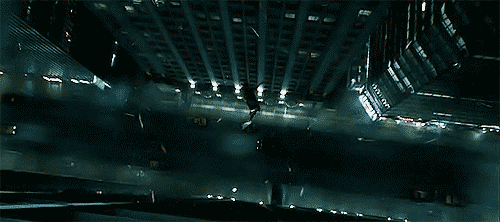

<!--- use Poster theme, black -->

---

## CocoaPods


---

## Contentful


---

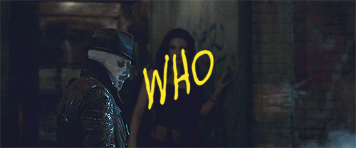

---

# 💰💰💰💰


---

# ᴡᴀᴛᴄʜ


---

# watchOS 1.x

- Notifications
- Glances
- WatchKit apps


---

# Notifications

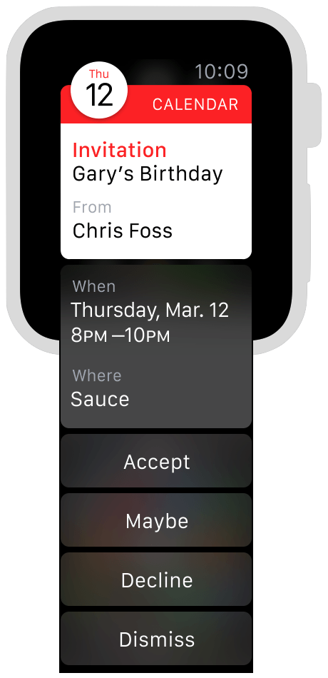


---

# Glances

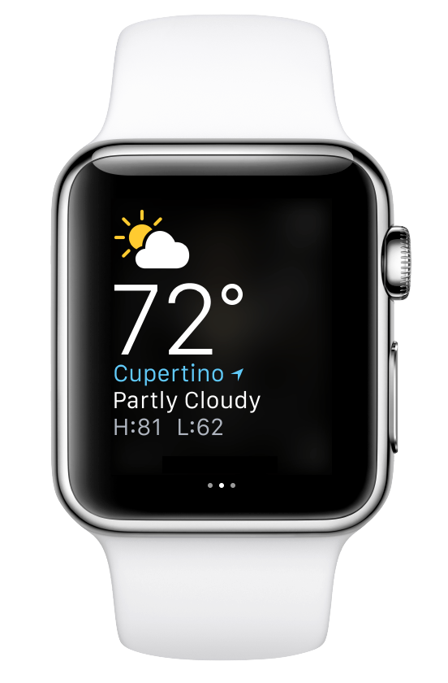


---

# WatchKit


---

# watchOS 2.x

- Apps run natively on the watch
- Custom complications


---

# !!!


---

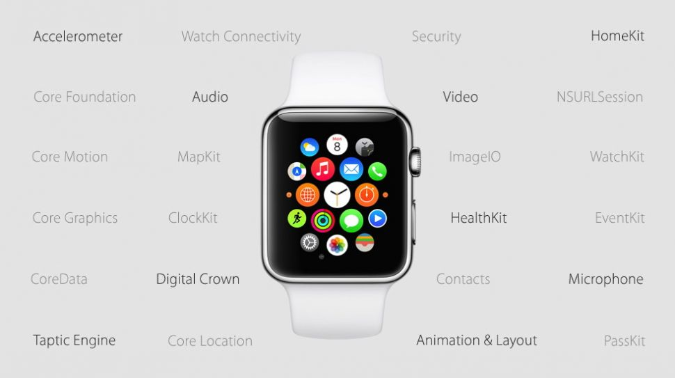

---

# Complications

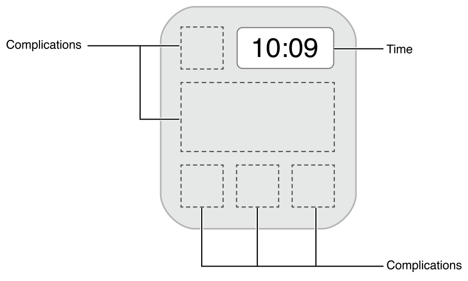


---

# Architecture

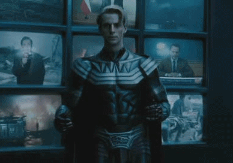

---

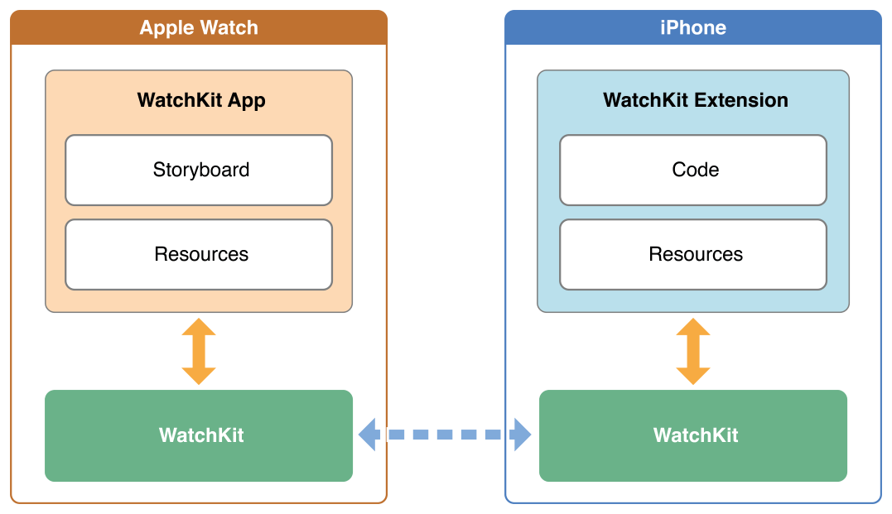


---

# watchOS 2

Extension

phone => watch


---

# Resources

- Interface.storyboard
- Asset catalogs


---

# Extension Delegate

```swift
class ExtensionDelegate: NSObject, WKExtensionDelegate {

    func applicationDidFinishLaunching() {
    }

    func applicationDidBecomeActive() {
    }

    func applicationWillResignActive() {
    }

}
```

---

# Interface Controller

```swift
class InterfaceController: WKInterfaceController {

    override func awakeWithContext(context: AnyObject?) {
        super.awakeWithContext(context)
    }

    override func willActivate() {
        super.willActivate()
    }

    override func didDeactivate() {
        super.didDeactivate()
    }

}
```

---

# WKInterfaceController

- Navigation
- Presentation
- Handoff
- Handle notification actions
- Communicate with parent app


---

# Design

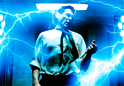

---

# Principles

- Lightweight interactions
- Holistic design
- Personal communication


---

# Layout

- based on horizontal or vertical groups
- very similar to `UIStackView`
- two device sizes (38mm and 42mm)
- edge-to-edge, bezel provides margins


---

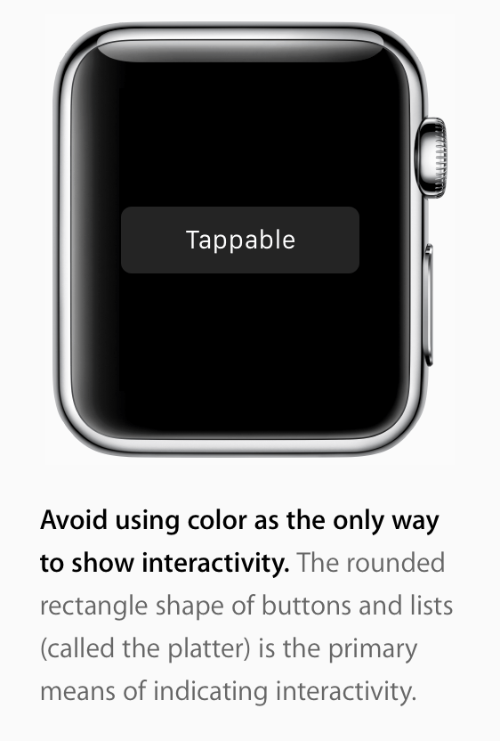


---

# Some examples

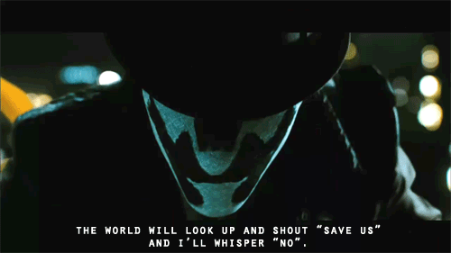

---


---


---

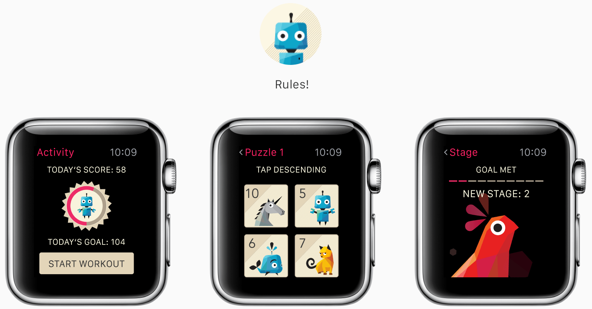


---

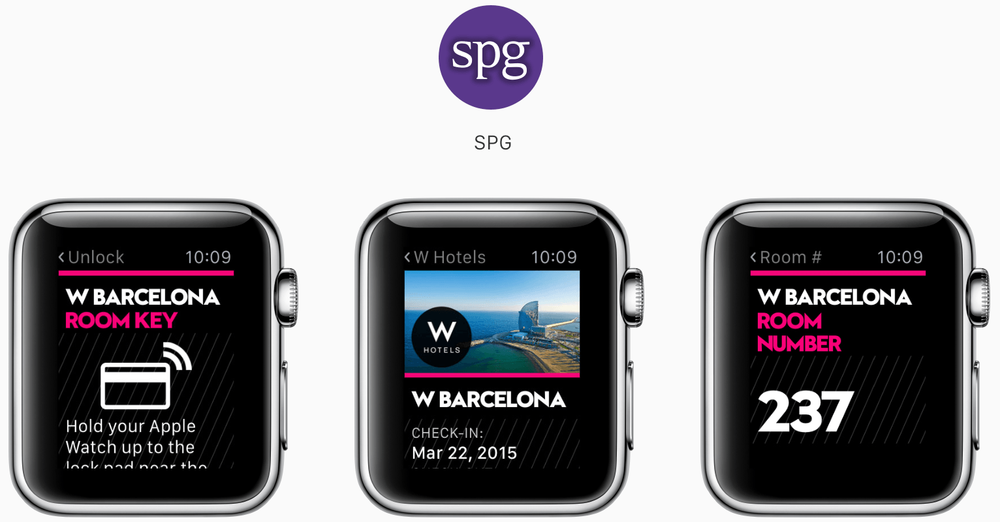


---

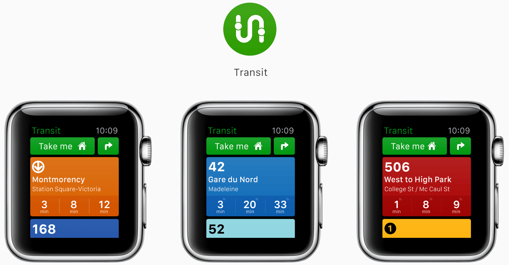


---

# Building a simple app


---

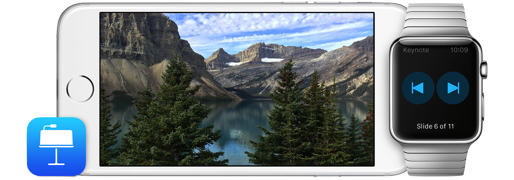


---

# WatchPresenter

- Remote controls Deckset instead
- Direct connection to the Mac
- Shows a preview of the slides
- Measures heartrate to display the "most exciting" slide
- Taps you if you're running out of time


---

## Multipeer Connectivity!


---

# Available Frameworks

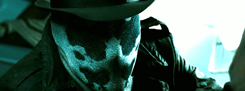

---

CFNetwork.framework
ClockKit.framework
Contacts.framework
CoreData.framework
CoreFoundation.framework
CoreGraphics.framework
CoreLocation.framework
CoreMotion.framework
EventKit.framework
Foundation.framework

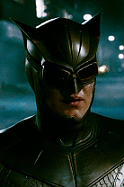

---

HealthKit.framework
HomeKit.framework
ImageIO.framework
MapKit.framework
MobileCoreServices.framework
PassKit.framework
Security.framework
UIKit.framework
WatchConnectivity.framework
WatchKit.framework

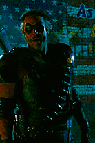

---

# BT APIs are private :(


---

# Other options

- `NSURLSession` via Wi-Fi
- WatchConnectivity.framework to talk via the phone


---

# HealthKit.framework

- not usable in the Watch simulator

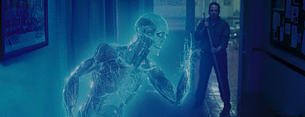

---

# Taptic Engine

```objectivec
typedef NS_ENUM(NSInteger, WKHapticType) {
    WKHapticTypeNotification,
    WKHapticTypeDirectionUp,
    WKHapticTypeDirectionDown,
    WKHapticTypeSuccess,
    WKHapticTypeFailure,
    WKHapticTypeRetry,
    WKHapticTypeStart,
    WKHapticTypeStop,
    WKHapticTypeClick
} WK_AVAILABLE_WATCHOS_ONLY(2.0);
```

```swift
WKInterfaceDevice.currentDevice().playHaptic(.Start)
```

---

### but also not usable in the sim


---

# Demo

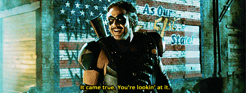

---

# Tips


---

# `printf` debugging is great!


---

# MMWormhole

- watchOS 1.0: `CFNotificationCenter`
- watchOS 2.0: WatchConnectivity.framework

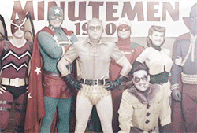

---

# Force quit apps

- Long press until "reboot" menu
- Long press again


---

## If in doubt, reboot the watch :)


---

# What have we learned?

- Code isn't very different from iOS apps
- But design very much is


---

# Thank you!


---

- https://developer.apple.com/watch/human-interface-guidelines/
- https://developer.apple.com/library/prerelease/watchos/documentation/General/Conceptual/AppleWatch2TransitionGuide/
- https://github.com/shu223/watchOS-2-Sampler
- http://www.kristinathai.com/category/watchkit/


---

@NeoNacho

boris@contentful.com

http://buegling.com/talks


